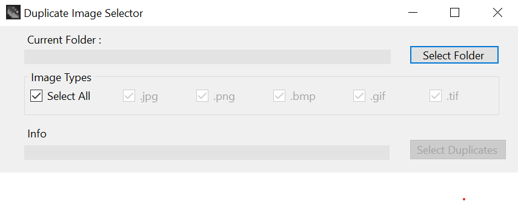

# Duplicate Image Selector
A simple application that finds duplicate images.

Duplicate Image Selector finds all duplicate images in a directory. 
It is non-destructive and does not delete images but instead moves them to a _duplicates directory inside the current directory.

Using Duplicate Image Selector
-Select a folder that has images in it.
-Select an image type or types to find all images of those formats. Selecting all checks all supported formats.
-Press the select duplicates button to find and move any duplicate. The info text will show its progress.
